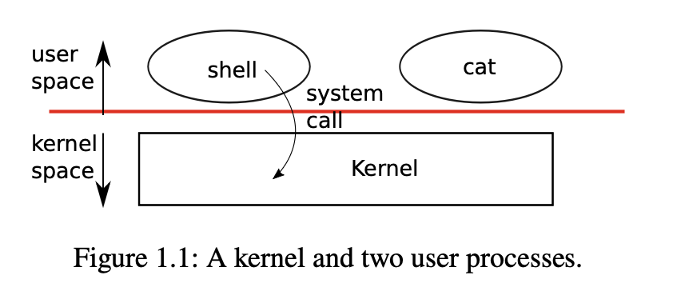

# Chapter 1

# Operating system interfaces

The job of an operating system is to share a computer among multiple programs and to provide a
more useful set of services than the hardware alone supports. An operating system manages and
abstracts the low-level hardware, so that, for example, a word processor need not concern itself
with which type of disk hardware is being used. An operating system shares the hardware among
multiple programs so that they run (or appear to run) at the same time. Finally, operating systems
provide controlled ways for programs to interact, so that they can share data or work together.
An operating system provides services to user programs through an interface. Designing a good
interface turns out to be difficult. On the one hand, we would like the interface to be simple and
narrow because that makes it easier to get the implementation right. On the other hand, we may be
tempted to offer many sophisticated features to applications. The trick in resolving this tension is to
design interfaces that rely on a few mechanisms that can be combined to provide much generality.
This book uses a single operating system as a concrete example to illustrate operating system
concepts. That operating system, xv6, provides the basic interfaces introduced by Ken Thompson
and Dennis Ritchie’s Unix operating system [17], as well as mimicking Unix’s internal design.
Unix provides a narrow interface whose mechanisms combine well, offering a surprising degree
of generality. This interface has been so successful that modern operating systems—BSD, Linux,
macOS, Solaris, and even, to a lesser extent, Microsoft Windows—have Unix-like interfaces. Un-
derstanding xv6 is a good start toward understanding any of these systems and many others.
As Figure 1.1 shows, xv6 takes the traditional form of akernel, a special program that provides
services to running programs. Each running program, called aprocess, has memory containing
instructions, data, and a stack. The instructions implement the program’s computation. The data
are the variables on which the computation acts. The stack organizes the program’s procedure calls.
A given computer typically has many processes but only a single kernel.
When a process needs to invoke a kernel service, it invokes asystem call, one of the calls in
the operating system’s interface. The system call enters the kernel; the kernel performs the service
and returns. Thus a process alternates between executing inuser spaceandkernel space.
As described in detail in subsequent chapters, the kernel uses the hardware protection mech-
anisms provided by a CPU^1 to ensure that each process executing in user space can access only

(^1) This text generally refers to the hardware element that executes a computation with the termCPU, an acronym



its own memory. The kernel executes with the hardware privileges required to implement these
protections; user programs execute without those privileges. When a user program invokes a sys-
tem call, the hardware raises the privilege level and starts executing a pre-arranged function in the
kernel.

The collection of system calls that a kernel provides is the interface that user programs see. The
xv6 kernel provides a subset of the services and system calls that Unix kernels traditionally offer.


Figure 1.2 lists all of xv6’s system calls.

The rest of this chapter outlines xv6’s services—processes, memory, file descriptors, pipes,
and a file system—and illustrates them with code snippets and discussions of how theshell, Unix’s
command-line user interface, uses them. The shell’s use of system calls illustrates how carefully
they have been designed.
The shell is an ordinary program that reads commands from the user and executes them. The
fact that the shell is a user program, and not part of the kernel, illustrates the power of the system
call interface: there is nothing special about the shell. It also means that the shell is easy to replace;
as a result, modern Unix systems have a variety of shells to choose from, each with its own user
interface and scripting features. The xv6 shell is a simple implementation of the essence of the
Unix Bourne shell. Its implementation can be found at(user/sh.c:1).

### 1.1 Processes and memory

An xv6 process consists of user-space memory (instructions, data, and stack) and per-process state
private to the kernel. Xv6time-shares processes: it transparently switches the available CPUs
among the set of processes waiting to execute. When a process is not executing, xv6 saves the
process’s CPU registers, restoring them when it next runs the process. The kernel associates a
process identifier, orPID, with each process.

A process may create a new process using theforksystem call.forkgives the new process an
exact copy of the calling process’s memory: it copies the instructions, data, and stack of the calling
process into the new process’s memory.forkreturns in both the original and new processes. In
the original process,forkreturns the new process’s PID. In the new process,forkreturns zero.
The original and new processes are often called theparentandchild.

for central processing unit. Other documentation (e.g., the RISC-V specification) also uses the words processor, core,
and hart instead of CPU.


```
System call Description
int fork() Create a process, return child’s PID.
int exit(int status) Terminate the current process; status reported to wait(). No return.
int wait(int *status) Wait for a child to exit; exit status in *status; returns child PID.
int kill(int pid) Terminate process PID. Returns 0, or -1 for error.
int getpid() Return the current process’s PID.
int sleep(int n) Pause for n clock ticks.
int exec(char *file, char *argv[]) Load a file and execute it with arguments; only returns if error.
char *sbrk(int n) Grow process’s memory by n zero bytes. Returns start of new memory.
int open(char *file, int flags) Open a file; flags indicate read/write; returns an fd (file descriptor).
int write(int fd, char *buf, int n) Write n bytes from buf to file descriptor fd; returns n.
int read(int fd, char *buf, int n) Read n bytes into buf; returns number read; or 0 if end of file.
int close(int fd) Release open file fd.
int dup(int fd) Return a new file descriptor referring to the same file as fd.
int pipe(int p[]) Create a pipe, put read/write file descriptors in p[0] and p[1].
int chdir(char *dir) Change the current directory.
int mkdir(char *dir) Create a new directory.
int mknod(char *file, int, int) Create a device file.
int fstat(int fd, struct stat *st) Place info about an open file into *st.
int link(char *file1, char *file2) Create another name (file2) for the file file1.
int unlink(char *file) Remove a file.
```
Figure 1.2: Xv6 system calls. If not otherwise stated, these calls return 0 for no error, and -1 if
there’s an error.

For example, consider the following program fragment written in the C programming lan-
guage [7]:

```c
int pid = fork();
if(pid > 0){
printf("parent: child=%d\n", pid);
pid = wait((int *) 0);
printf("child %d is done\n", pid);
} else if(pid == 0){
printf("child: exiting\n");
exit(0);
} else {
printf("fork error\n");
}
```
Theexitsystem call causes the calling process to stop executing and to release resources such as
memory and open files. Exit takes an integer status argument, conventionally 0 to indicate success
and 1 to indicate failure. Thewaitsystem call returns the PID of an exited (or killed) child of
the current process and copies the exit status of the child to the address passed to wait; if none of


the caller’s children has exited,waitwaits for one to do so. If the caller has no children,wait
immediately returns -1. If the parent doesn’t care about the exit status of a child, it can pass a 0
address towait.
In the example, the output lines
parent: child=
child: exiting

might come out in either order (or even intermixed), depending on whether the parent or child gets
to itsprintfcall first. After the child exits, the parent’swaitreturns, causing the parent to print

```
parent: child 1234 is done
```
Although the child has the same memory contents as the parent initially, the parent and child are
executing with separate memory and separate registers: changing a variable in one does not affect
the other. For example, when the return value ofwaitis stored intopidin the parent process, it
doesn’t change the variablepidin the child. The value ofpidin the child will still be zero.
Theexecsystem call replaces the calling process’s memory with a new memory image loaded
from a file stored in the file system. The file must have a particular format, which specifies which
part of the file holds instructions, which part is data, at which instruction to start, etc. Xv6 uses the
ELF format, which Chapter 3 discusses in more detail. Usually the file is the result of compiling
a program’s source code. Whenexecsucceeds, it does not return to the calling program; instead,
the instructions loaded from the file start executing at the entry point declared in the ELF header.
exectakes two arguments: the name of the file containing the executable and an array of string
arguments. For example:

```
char *argv[3];
```
```
argv[0] = "echo";
argv[1] = "hello";
argv[2] = 0;
exec("/bin/echo", argv);
printf("exec error\n");
```
This fragment replaces the calling program with an instance of the program/bin/echorunning
with the argument listecho hello. Most programs ignore the first element of the argument array,
which is conventionally the name of the program.
The xv6 shell uses the above calls to run programs on behalf of users. The main structure of
the shell is simple; seemain(user/sh.c:146). The main loop reads a line of input from the user with
getcmd. Then it callsfork, which creates a copy of the shell process. The parent callswait,
while the child runs the command. For example, if the user had typed “echo hello” to the shell,
runcmdwould have been called with “echo hello” as the argument.runcmd(user/sh.c:55)runs
the actual command. For “echo hello”, it would callexec(user/sh.c:79). Ifexecsucceeds then
the child will execute instructions fromechoinstead ofruncmd. At some pointechowill call
exit, which will cause the parent to return fromwaitinmain(user/sh.c:146).
You might wonder whyforkandexecare not combined in a single call; we will see later that
the shell exploits the separation in its implementation of I/O redirection. To avoid the wastefulness


of creating a duplicate process and then immediately replacing it (withexec), operating kernels
optimize the implementation offorkfor this use case by using virtual memory techniques such
as copy-on-write (see Section 4.6).
Xv6 allocates most user-space memory implicitly:forkallocates the memory required for the
child’s copy of the parent’s memory, andexecallocates enough memory to hold the executable
file. A process that needs more memory at run-time (perhaps formalloc) can callsbrk(n)to
grow its data memory bynzero bytes;sbrkreturns the location of the new memory.

### 1.2 I/O and File descriptors

Afile descriptoris a small integer representing a kernel-managed object that a process may read
from or write to. A process may obtain a file descriptor by opening a file, directory, or device,
or by creating a pipe, or by duplicating an existing descriptor. For simplicity we’ll often refer
to the object a file descriptor refers to as a “file”; the file descriptor interface abstracts away the
differences between files, pipes, and devices, making them all look like streams of bytes. We’ll
refer to input and output asI/O.
Internally, the xv6 kernel uses the file descriptor as an index into a per-process table, so that
every process has a private space of file descriptors starting at zero. By convention, a process reads
from file descriptor 0 (standard input), writes output to file descriptor 1 (standard output), and
writes error messages to file descriptor 2 (standard error). As we will see, the shell exploits the
convention to implement I/O redirection and pipelines. The shell ensures that it always has three
file descriptors open(user/sh.c:152), which are by default file descriptors for the console.
Thereadandwritesystem calls read bytes from and write bytes to open files named by file
descriptors. The callread(fd,buf,n)reads at mostnbytes from the file descriptorfd, copies
them intobuf, and returns the number of bytes read. Each file descriptor that refers to a file has an
offset associated with it.readreads data from the current file offset and then advances that offset
by the number of bytes read: a subsequentreadwill return the bytes following the ones returned
by the firstread. When there are no more bytes to read,readreturns zero to indicate the end of
the file.
The callwrite(fd,buf,n)writesnbytes frombufto the file descriptorfdand returns the
number of bytes written. Fewer thannbytes are written only when an error occurs. Likeread,
writewrites data at the current file offset and then advances that offset by the number of bytes
written: eachwritepicks up where the previous one left off.
The following program fragment (which forms the essence of the programcat) copies data
from its standard input to its standard output. If an error occurs, it writes a message to the standard
error.

```
char buf[512];
int n;
```
```
for(;;){
n = read(0, buf, sizeof buf);
if(n == 0)
```

```
break;
if(n < 0){
fprintf(2, "read error\n");
exit(1);
}
if(write(1, buf, n) != n){
fprintf(2, "write error\n");
exit(1);
}
}
```
The important thing to note in the code fragment is thatcatdoesn’t know whether it is reading
from a file, console, or a pipe. Similarlycatdoesn’t know whether it is printing to a console, a
file, or whatever. The use of file descriptors and the convention that file descriptor 0 is input and
file descriptor 1 is output allows a simple implementation ofcat.
Theclosesystem call releases a file descriptor, making it free for reuse by a futureopen,
pipe, ordupsystem call (see below). A newly allocated file descriptor is always the lowest-
numbered unused descriptor of the current process.
File descriptors andforkinteract to make I/O redirection easy to implement.forkcopies
the parent’s file descriptor table along with its memory, so that the child starts with exactly the
same open files as the parent. The system callexecreplaces the calling process’s memory but
preserves its file table. This behavior allows the shell to implementI/O redirectionby forking, re-
opening chosen file descriptors in the child, and then callingexecto run the new program. Here
is a simplified version of the code a shell runs for the commandcat < input.txt:

```
char *argv[2];
```
```
argv[0] = "cat";
argv[1] = 0;
if(fork() == 0) {
close(0);
open("input.txt", O_RDONLY);
exec("cat", argv);
}
```
After the child closes file descriptor 0,openis guaranteed to use that file descriptor for the newly
openedinput.txt: 0 will be the smallest available file descriptor.catthen executes with file
descriptor 0 (standard input) referring toinput.txt. The parent process’s file descriptors are not
changed by this sequence, since it modifies only the child’s descriptors.

The code for I/O redirection in the xv6 shell works in exactly this way(user/sh.c:83). Recall that
at this point in the code the shell has already forked the child shell and thatruncmdwill callexec
to load the new program.
The second argument toopenconsists of a set of flags, expressed as bits, that control what
opendoes. The possible values are defined in the file control (fcntl) header(kernel/fcntl.h:1-5):
O_RDONLY,O_WRONLY,O_RDWR,O_CREATE, andO_TRUNC, which instructopento open the file


for reading, or for writing, or for both reading and writing, to create the file if it doesn’t exist, and
to truncate the file to zero length.

Now it should be clear why it is helpful thatforkandexecare separate calls: between the
two, the shell has a chance to redirect the child’s I/O without disturbing the I/O setup of the main
shell. One could instead imagine a hypothetical combinedforkexecsystem call, but the options
for doing I/O redirection with such a call seem awkward. The shell could modify its own I/O
setup before callingforkexec(and then un-do those modifications); orforkexeccould take
instructions for I/O redirection as arguments; or (least attractively) every program likecatcould
be taught to do its own I/O redirection.

Althoughforkcopies the file descriptor table, each underlying file offset is shared between
parent and child. Consider this example:

```
if(fork() == 0) {
write(1, "hello ", 6);
exit(0);
} else {
wait(0);
write(1, "world\n", 6);
}
```
At the end of this fragment, the file attached to file descriptor 1 will contain the datahello world.
Thewritein the parent (which, thanks towait, runs only after the child is done) picks up where
the child’swriteleft off. This behavior helps produce sequential output from sequences of shell
commands, like(echo hello;echo world) >output.txt.

Thedupsystem call duplicates an existing file descriptor, returning a new one that refers to
the same underlying I/O object. Both file descriptors share an offset, just as the file descriptors
duplicated byforkdo. This is another way to writehello worldinto a file:

```
fd = dup(1);
write(1, "hello ", 6);
write(fd, "world\n", 6);
```
Two file descriptors share an offset if they were derived from the same original file descriptor
by a sequence offorkanddupcalls. Otherwise file descriptors do not share offsets, even if they
resulted fromopencalls for the same file.dupallows shells to implement commands like this:
ls existing-file non-existing-file > tmp1 2>&1. The2>&1tells the shell to give the
command a file descriptor 2 that is a duplicate of descriptor 1. Both the name of the existing file
and the error message for the non-existing file will show up in the filetmp1. The xv6 shell doesn’t
support I/O redirection for the error file descriptor, but now you know how to implement it.

File descriptors are a powerful abstraction, because they hide the details of what they are con-
nected to: a process writing to file descriptor 1 may be writing to a file, to a device like the console,
or to a pipe.


### 1.3 Pipes

Apipeis a small kernel buffer exposed to processes as a pair of file descriptors, one for reading
and one for writing. Writing data to one end of the pipe makes that data available for reading from
the other end of the pipe. Pipes provide a way for processes to communicate.
The following example code runs the programwcwith standard input connected to the read
end of a pipe.

```
int p[2];
char *argv[2];
```
```
argv[0] = "wc";
argv[1] = 0;
```
```
pipe(p);
if(fork() == 0) {
close(0);
dup(p[0]);
close(p[0]);
close(p[1]);
exec("/bin/wc", argv);
} else {
close(p[0]);
write(p[1], "hello world\n", 12);
close(p[1]);
}
```
The program callspipe, which creates a new pipe and records the read and write file descriptors
in the arrayp. Afterfork, both parent and child have file descriptors referring to the pipe. The
child callscloseanddupto make file descriptor zero refer to the read end of the pipe, closes the
file descriptors inp, and callsexecto runwc. Whenwcreads from its standard input, it reads from
the pipe. The parent closes the read side of the pipe, writes to the pipe, and then closes the write
side.
If no data is available, areadon a pipe waits for either data to be written or for all file descrip-
tors referring to the write end to be closed; in the latter case,readwill return 0, just as if the end of
a data file had been reached. The fact thatreadblocks until it is impossible for new data to arrive
is one reason that it’s important for the child to close the write end of the pipe before executing
wcabove: if one ofwc’s file descriptors referred to the write end of the pipe,wcwould never see
end-of-file.
The xv6 shell implements pipelines such asgrep fork sh.c | wc -lin a manner similar
to the above code(user/sh.c:101). The child process creates a pipe to connect the left end of the
pipeline with the right end. Then it callsforkandruncmdfor the left end of the pipeline and
forkandruncmdfor the right end, and waits for both to finish. The right end of the pipeline
may be a command that itself includes a pipe (e.g.,a | b | c), which itself forks two new child
processes (one forband one forc). Thus, the shell may create a tree of processes. The leaves


of this tree are commands and the interior nodes are processes that wait until the left and right
children complete.
Pipes may seem no more powerful than temporary files: the pipeline
echo hello world | wc

could be implemented without pipes as

```
echo hello world >/tmp/xyz; wc </tmp/xyz
```
Pipes have at least three advantages over temporary files in this situation. First, pipes automatically
clean themselves up; with the file redirection, a shell would have to be careful to remove/tmp/xyz
when done. Second, pipes can pass arbitrarily long streams of data, while file redirection requires
enough free space on disk to store all the data. Third, pipes allow for parallel execution of pipeline
stages, while the file approach requires the first program to finish before the second starts.

### 1.4 File system

The xv6 file system provides data files, which contain uninterpreted byte arrays, and directories,
which contain named references to data files and other directories. The directories form a tree,
starting at a special directory called theroot. Apathlike/a/b/crefers to the file or directory
namedcinside the directory namedbinside the directory namedain the root directory/. Paths
that don’t begin with/are evaluated relative to the calling process’scurrent directory, which can
be changed with thechdirsystem call. Both these code fragments open the same file (assuming
all the directories involved exist):

```
chdir("/a");
chdir("b");
open("c", O_RDONLY);
```
```
open("/a/b/c", O_RDONLY);
```
The first fragment changes the process’s current directory to/a/b; the second neither refers to nor
changes the process’s current directory.
There are system calls to create new files and directories:mkdircreates a new directory,open
with theO_CREATEflag creates a new data file, andmknodcreates a new device file. This example
illustrates all three:

```
mkdir("/dir");
fd = open("/dir/file", O_CREATE|O_WRONLY);
close(fd);
mknod("/console", 1, 1);
```
mknodcreates a special file that refers to a device. Associated with a device file are the major and
minor device numbers (the two arguments tomknod), which uniquely identify a kernel device.
When a process later opens a device file, the kernel divertsreadandwritesystem calls to the
kernel device implementation instead of passing them to the file system.


A file’s name is distinct from the file itself; the same underlying file, called aninode, can have
multiple names, calledlinks. Each link consists of an entry in a directory; the entry contains a file
name and a reference to an inode. An inode holdsmetadataabout a file, including its type (file or
directory or device), its length, the location of the file’s content on disk, and the number of links to
a file.
Thefstatsystem call retrieves information from the inode that a file descriptor refers to. It
fills in astruct stat, defined instat.h(kernel/stat.h)as:

```
#define T_DIR 1 // Directory
#define T_FILE 2 // File
#define T_DEVICE 3 // Device
```
struct stat {
int dev; // File system’s disk device
uint ino; // Inode number
short type; // Type of file
short nlink; // Number of links to file
uint64 size; // Size of file in bytes
};
Thelinksystem call creates another file system name referring to the same inode as an exist-
ing file. This fragment creates a new file named bothaandb.

```
open("a", O_CREATE|O_WRONLY);
link("a", "b");
```
Reading from or writing toais the same as reading from or writing tob. Each inode is identified
by a uniqueinode number. After the code sequence above, it is possible to determine thataandb
refer to the same underlying contents by inspecting the result offstat: both will return the same
inode number (ino), and thenlinkcount will be set to 2.
Theunlinksystem call removes a name from the file system. The file’s inode and the disk
space holding its content are only freed when the file’s link count is zero and no file descriptors
refer to it. Thus adding

```
unlink("a");
```
to the last code sequence leaves the inode and file content accessible asb. Furthermore,

```
fd = open("/tmp/xyz", O_CREATE|O_RDWR);
unlink("/tmp/xyz");
```
is an idiomatic way to create a temporary inode with no name that will be cleaned up when the
process closesfdor exits.
Unix provides file utilities callable from the shell as user-level programs, for examplemkdir,
ln, andrm. This design allows anyone to extend the command-line interface by adding new user-
level programs. In hindsight this plan seems obvious, but other systems designed at the time of
Unix often built such commands into the shell (and built the shell into the kernel).
One exception iscd, which is built into the shell(user/sh.c:161).cdmust change the current
working directory of the shell itself. Ifcdwere run as a regular command, then the shell would


fork a child process, the child process would runcd, andcdwould change thechild’s working
directory. The parent’s (i.e., the shell’s) working directory would not change.

### 1.5 Real world

Unix’s combination of “standard” file descriptors, pipes, and convenient shell syntax for operations
on them was a major advance in writing general-purpose reusable programs. The idea sparked a
culture of “software tools” that was responsible for much of Unix’s power and popularity, and the
shell was the first so-called “scripting language.” The Unix system call interface persists today in
systems like BSD, Linux, and macOS.
The Unix system call interface has been standardized through the Portable Operating System
Interface (POSIX) standard. Xv6 isnotPOSIX compliant: it is missing many system calls (in-
cluding basic ones such aslseek), and many of the system calls it does provide differ from the
standard. Our main goals for xv6 are simplicity and clarity while providing a simple UNIX-like
system-call interface. Several people have extended xv6 with a few more system calls and a sim-
ple C library in order to run basic Unix programs. Modern kernels, however, provide many more
system calls, and many more kinds of kernel services, than xv6. For example, they support net-
working, windowing systems, user-level threads, drivers for many devices, and so on. Modern
kernels evolve continuously and rapidly, and offer many features beyond POSIX.
Unix unified access to multiple types of resources (files, directories, and devices) with a single
set of file-name and file-descriptor interfaces. This idea can be extended to more kinds of resources;
a good example is Plan 9 [16], which applied the “resources are files” concept to networks, graph-
ics, and more. However, most Unix-derived operating systems have not followed this route.
The file system and file descriptors have been powerful abstractions. Even so, there are other
models for operating system interfaces. Multics, a predecessor of Unix, abstracted file storage in a
way that made it look like memory, producing a very different flavor of interface. The complexity
of the Multics design had a direct influence on the designers of Unix, who aimed to build something
simpler.
Xv6 does not provide a notion of users or of protecting one user from another; in Unix terms,
all xv6 processes run as root.
This book examines how xv6 implements its Unix-like interface, but the ideas and concepts
apply to more than just Unix. Any operating system must multiplex processes onto the underlying
hardware, isolate processes from each other, and provide mechanisms for controlled inter-process
communication. After studying xv6, you should be able to look at other, more complex operating
systems and see the concepts underlying xv6 in those systems as well.

### 1.6 Exercises

1. Write a program that uses UNIX system calls to “ping-pong” a byte between two processes
    over a pair of pipes, one for each direction. Measure the program’s performance, in ex-
    changes per second.
